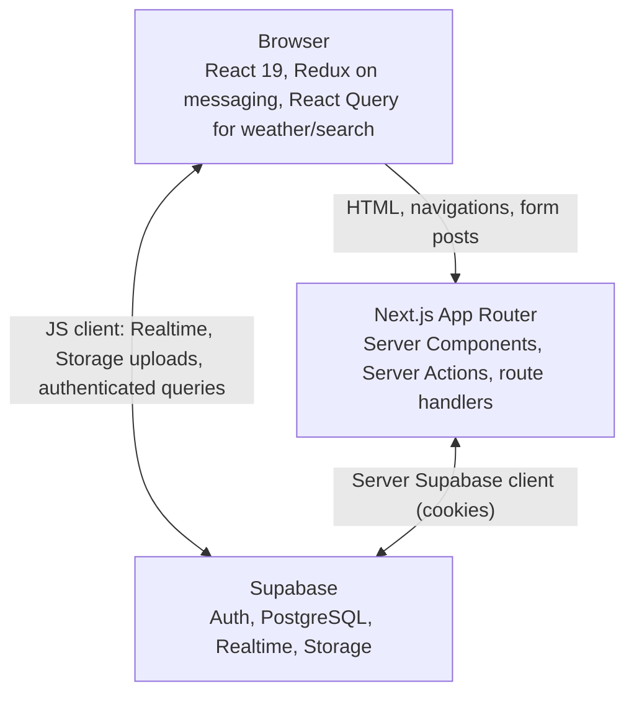
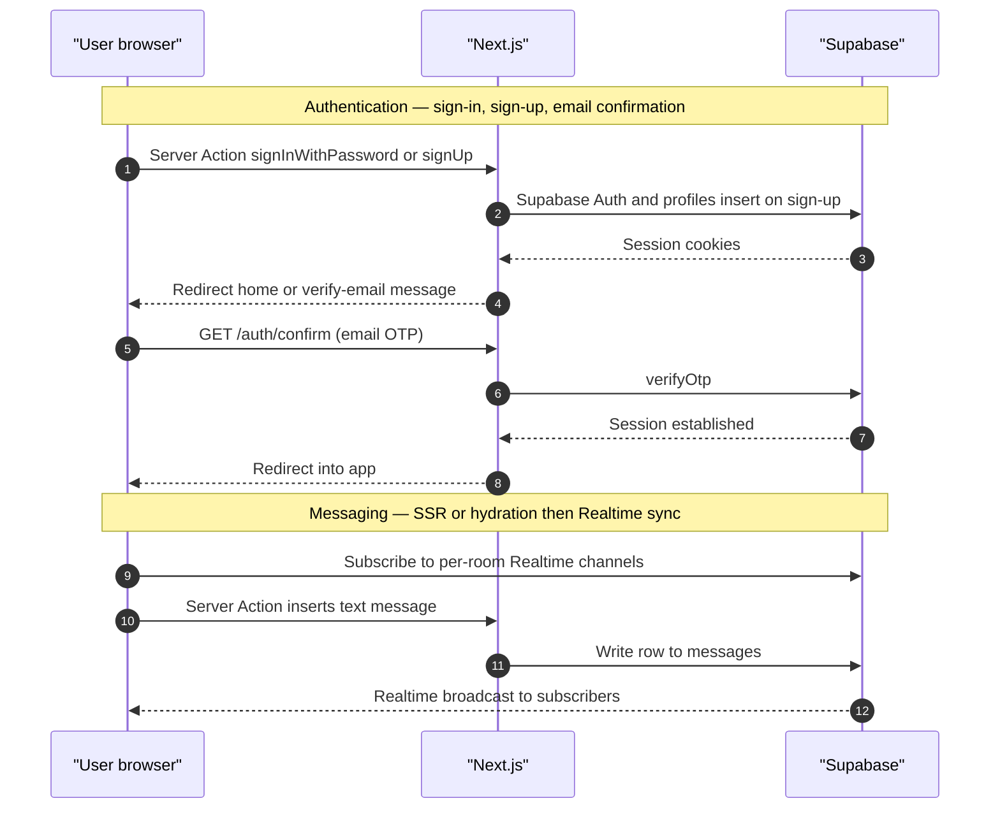

# Social Fitness Platform

A fitness-tracking app with social features, built with React and Next.js.
This repository is presented as a **portfolio project for a junior React developer role**, and is also maintained as an ongoing personal project.

---

## ✨ Key Features

- **Authentication (Supabase Auth)**
  - Sign up / log in / log out with email
- **Activity Management**
  - Create, edit, and delete activities
  - Category-based inputs (distance / duration / location, etc.)
  - Paginated activity list
- **Analytics Dashboard**
  - Time-range summaries (7 / 30 / 60 / 90 days)
  - Visualization of distance, duration, and category trends
- **Social Features**
  - User search
  - Friend requests / approval / rejection
  - View friends’ activities
- **Messaging**
  - Create 1-on-1 chat rooms
  - Send and receive messages
  - Realtime subscriptions
- **Profile**
  - Edit profile
  - Upload avatar
- **Other**
  - Weather card (location-based)
  - Dashboard UI centered around a sidebar layout

---

## 🧱 Tech Stack

- **Framework**: Next.js 16 (App Router), React 19, TypeScript
- **Styling/UI**: Tailwind CSS v4, shadcn/ui, Radix UI
- **Backend/BaaS**: Supabase (Auth / Database / Storage / Realtime)
- **Charts**: Recharts
- **Validation**: Zod
- **Linting**: ESLint

---

## 🌐 Public Demo

The app is also available as a public deployment for portfolio review:

- https://social-fitness-platform-next-v4.vercel.app/

### Reviewer Access Notes

- Authentication is required. Unauthenticated access is redirected to `/login`.
- Use the public demo account for review:
  - Email: `hidekazu.ueba@example.com`
  - Password: `password`
- If sign-up is enabled in the current environment, reviewers can create an account from `/register`.
- After signing in, reviewers can inspect the main authenticated flows: activity tracking, analytics, friend search/requests, messaging, profile editing, and the weather card on the home screen.
- This repository does not store deployment-specific secrets. If you share the hosted app for review, only use demo-safe credentials and demo-safe data.

### Vercel Deployment Notes

To reproduce the public demo deployment on Vercel, configure these environment variables in the Vercel project:

```bash
NEXT_PUBLIC_SUPABASE_URL=your_hosted_supabase_project_url
NEXT_PUBLIC_SUPABASE_PUBLISHABLE_KEY=your_hosted_supabase_publishable_key
APP_URL=https://social-fitness-platform-next-v4.vercel.app
```

Notes:

- `NEXT_PUBLIC_SUPABASE_URL` should point to the hosted Supabase project used by the public demo.
- `NEXT_PUBLIC_SUPABASE_PUBLISHABLE_KEY` should be the publishable/anon key for that hosted Supabase project.
- `APP_URL` must match the public Vercel deployment URL so email auth redirects resolve correctly in production.
- Do not expose service role keys in client-facing Vercel environment variables.
- Only use demo-safe data and demo-safe credentials in the public deployment.

---

## 🏗 Reviewer Notes: Architecture and Performance

### Architecture at a glance

**Diagram format:** High-level architecture is documented with **Mermaid diagrams in this README** so they render on GitHub without maintaining separate image files under `docs/` or linking to external diagram tools. For import-level dependency graphs, consider [dependency-cruiser](https://github.com/sverweij/dependency-cruiser) locally if you need machine-generated maps.

#### Containers (C4-style, simplified)



#### Main flows: authentication and messaging



- **App Router separation**
  - Server-rendered routes handle auth-aware data loading and page composition.
  - Client components are used where browser APIs, form state, or live subscriptions are required.
- **Why Supabase is the backend**
  - Supabase combines auth, relational data, storage, and realtime messaging in one stack, which keeps the scope realistic for a solo portfolio app while still covering full-stack concerns.
- **Why React Query is used**
  - React Query is used selectively for client-only fetches that benefit from built-in loading/error state, request cancellation, retry handling, and short-lived caching.
  - In this project that mainly applies to browser-driven data such as weather/geolocation and user search, where server rendering is not the best fit.
- **Caching and invalidation strategy**
  - React Query provides a small client cache with a `30s` `staleTime` for those browser-driven queries.
  - Server Actions call `revalidatePath(...)` after writes so pages backed by server-rendered data refresh predictably after activity, friend, or profile mutations.
  - Messaging is handled differently: the app loads initial room data, then keeps it fresh through realtime events instead of polling-based refetch loops.
- **Why Supabase Realtime is used in messaging**
  - Messaging needs low-latency updates for new messages, edits, deletes, read state, and reactions.
  - Supabase Realtime private channels allow the UI to stay synchronized across participants without repeatedly polling the database.

### Lighthouse summary (April 10, 2026)

| Page | Mobile (P/A/BP/SEO) | Desktop (P/A/BP/SEO) |
| --- | --- | --- |
| `/` | `83 / 92 / 96 / 63` | `99 / 92 / 96 / 63` |
| `/activity` | `93 / 87 / 96 / 63` | `99 / 87 / 96 / 63` |
| `/friend/friend-list` | `93 / 89 / 100 / 60` | `100 / 90 / 100 / 63` |
| `/friend/search` | `96 / 98 / 100 / 60` | `99 / 98 / 100 / 63` |
| `/message` | `not measured` | `99 / 97 / 100 / 63` |

Representative web vitals snapshots from the same audit pass:

- `/` mobile: **FCP** `1.4s`, **LCP** `2.4s`, **TTI** `4.4s`, **TBT** `530ms`, **CLS** `0`
- `/activity` mobile: **FCP** `1.1s`, **LCP** `1.7s`, **TTI** `3.8s`, **TBT** `234ms`, **CLS** `0`
- `/friend/friend-list` desktop: **FCP** `0.4s`, **LCP** `0.5s`, **TTI** `0.5s`, **TBT** `0ms`, **CLS** `0`
- `/message` desktop: **FCP** `0.3s`, **LCP** `0.5s`, **TTI** `0.5s`, **TBT** `0ms`, **CLS** `0`

Common findings across routes:

- Mobile bottlenecks are primarily client-side JavaScript execution and main-thread work after first paint.
- Accessibility gaps are mostly semantic labels and landmarks (icon-only controls, heading order, `<main>` landmark, contrast).
- SEO scores are held back by `noindex` in the public demo environment.
- Static asset/cache opportunities remain for avatars and large shared bundles.
- A production runtime issue (`Minified React error #418`) should be investigated and resolved.

Audit caveat:

- These Lighthouse results are reviewer-facing guidance, not a strict lab benchmark. Browser extensions, network state, and deployment headers can change scores.
- Full detailed logs are archived in `docs/performance/lighthouse-2026-04-10.md`.

---

## 📁 Directory Structure (Excerpt)

```text
app/
  (auth)/        # Login / signup
  (home)/        # Home (profile / weather / friends' activity)
  activity/      # Activity list & analytics
  friend/        # Friend management & search
  message/       # Messaging features
  profile/       # Profile editing
  api/           # Some API routes
components/      # UI / forms / cards
contexts/        # User and categories providers
hooks/           # Realtime hooks, etc.
lib/             # Supabase client, server helpers
types/           # API / domain types
```

---

## 🚀 Setup

### 1) Install dependencies

```bash
npm install
```

### 2) Create environment variables

Create `.env.local` at the project root and set the following values:

```bash
NEXT_PUBLIC_SUPABASE_URL=your_supabase_project_url
NEXT_PUBLIC_SUPABASE_PUBLISHABLE_KEY=your_supabase_anon_or_publishable_key
APP_URL=http://127.0.0.1:3000
```

> `APP_URL` is used as the redirect destination for email authentication.

### 3) Start the development server

```bash
npm run dev
```

Open `http://127.0.0.1:3000` in your browser.

---

## 🛠 Available Commands

```bash
npm run dev    # Start development server
npm run build  # Build for production
npm run start  # Start production server
npm run lint   # Run ESLint
npm run seed:users      # Create demo auth users and profile rows
npm run seed:friends    # Create demo friendships between seeded users
npm run seed:activities # Create demo activities for seeded users
npm run seed:all        # Run seed:users, seed:friends, and seed:activities
```

---

## 🗃 Supabase Schema and Seed Data

This repository now includes the database schema and base seed data required to run the app locally:

- `supabase/migrations/*`
  - Full database schema, RPC functions, RLS policies, and storage setup
- `supabase/seed.sql`
  - Base category seed data used by the app
- `scripts/seed-users.mjs`
  - Creates demo auth users and corresponding `profiles` rows
- `scripts/seed-friends.mjs`
  - Creates idempotent friendship records between seeded profiles
- `scripts/seed-activities.mjs`
  - Creates realistic demo activities for seeded users

The three Node seed scripts are intentionally separate from `supabase/seed.sql` because they rely on app-level Supabase access patterns instead of static SQL alone.

---

## 💻 Local Supabase Setup

### Prerequisites

- Node.js
- Docker Desktop (required by the Supabase CLI local stack)
- Supabase CLI

If you do not have the CLI yet:

```bash
brew install supabase/tap/supabase
```

### 1) Start local Supabase

```bash
supabase start
```

This project includes `supabase/config.toml`, so the local stack will use the repository's checked-in configuration.

### 2) Apply migrations and SQL seed data

For a clean local database:

```bash
supabase db reset
```

This applies all files in `supabase/migrations` and then runs `supabase/seed.sql`.

To apply bucket definitions from `supabase/config.toml` locally as well:

```bash
supabase seed buckets --local
```

### 3) Copy local Supabase credentials into `.env.local`

Run:

```bash
supabase status
```

Then set `.env.local` like this:

```bash
NEXT_PUBLIC_SUPABASE_URL=http://127.0.0.1:54321
NEXT_PUBLIC_SUPABASE_PUBLISHABLE_KEY=your_local_publishable_key
APP_URL=http://127.0.0.1:3000
SEED_USER_PASSWORD=password
```

Notes:

- Use the `API URL` and `anon key`/`publishable key` shown by `supabase status`
- `SEED_USER_PASSWORD` is optional, but setting it explicitly makes the local demo login credentials clear
- Local auth confirmations are disabled in `supabase/config.toml`, so seeded users can sign in immediately

### 4) Seed demo users

```bash
npm run seed:users
```

This script:

- creates demo users in Supabase Auth
- creates or updates matching rows in `public.profiles`
- uses the shared password from `SEED_USER_PASSWORD` or falls back to `password`

Demo users use emails like:

- `hidekazu.ueba@example.com`
- `alex.walker@example.com`
- `mia.summers@example.com`

### 5) Seed demo friendships

```bash
npm run seed:friends
```

This script:

- reads the seeded `profiles` rows by email
- creates bidirectional rows in `public.friends`
- skips friendships that already exist, so it can be rerun safely
- ensures `hidekazu.ueba@example.com` has at least 10 seeded friends

### 6) Seed demo activities

```bash
npm run seed:activities
```

This script:

- reads seeded profiles and categories
- signs in as each demo user
- inserts up to 20 activities per user
- skips users who already have enough activity data

### 7) Start the app

```bash
npm run dev
```

Open `http://127.0.0.1:3000`.

---

## 🌱 Recommended Local Onboarding Flow

For anyone cloning this project and wanting a fully working local dataset, the recommended flow is:

```bash
npm install
supabase start
supabase db reset
supabase seed buckets --local
supabase status
# update .env.local with the local URL and publishable key
npm run seed:users
npm run seed:friends
npm run seed:activities
npm run dev
```

If you want to rebuild the local dataset from scratch later, rerun:

```bash
supabase db reset
supabase seed buckets --local
npm run seed:users
npm run seed:friends
npm run seed:activities
```

---

## ☁️ Using a Hosted Supabase Project

If you prefer a hosted Supabase project instead of the local CLI stack, set `.env.local` to your hosted project's values:

```bash
NEXT_PUBLIC_SUPABASE_URL=your_supabase_project_url
NEXT_PUBLIC_SUPABASE_PUBLISHABLE_KEY=your_supabase_publishable_key
APP_URL=http://127.0.0.1:3000
SEED_USER_PASSWORD=password
```

Then:

1. Apply the schema from `supabase/migrations` to that project
2. Insert base categories from `supabase/seed.sql` (for example via the Supabase SQL editor or `psql`)
3. Run `npm run seed:users`
4. Run `npm run seed:friends` (needed for friend list and messaging demos)
5. Run `npm run seed:activities`

Configure storage buckets in the hosted project to match what the app expects (avatars, messages, and any buckets defined in `supabase/config.toml`), or uploads and messaging attachments may fail.

The seed scripts only require a publishable key because they create demo users through normal auth flows and then insert data while signed in as those users.

---

## 🗃 Main Supabase Resources

This app assumes the following Supabase resources are set up:

- Authentication (Email/Password)
- Tables (examples)
  - `profiles`
  - `categories`
  - `activities`
  - `activity_details`
  - `friend_requests`
  - `friends`
  - `rooms`
  - `room_user`
  - `messages`
- Storage bucket
  - `avatars`
- RPC (example)
  - `are_users_in_same_room`

---

## 🎯 What to Focus on in This Portfolio

- Server/client responsibility separation with App Router
- Integrated authentication + CRUD + Realtime using Supabase
- UI component modularization and reusability
- Continuous feature expansion as an actively maintained solo project

---

## 📄 License

No license file is included yet; this project is intended for personal development and portfolio use. Add a `LICENSE` file when you want to grant reuse terms (for example MIT).
